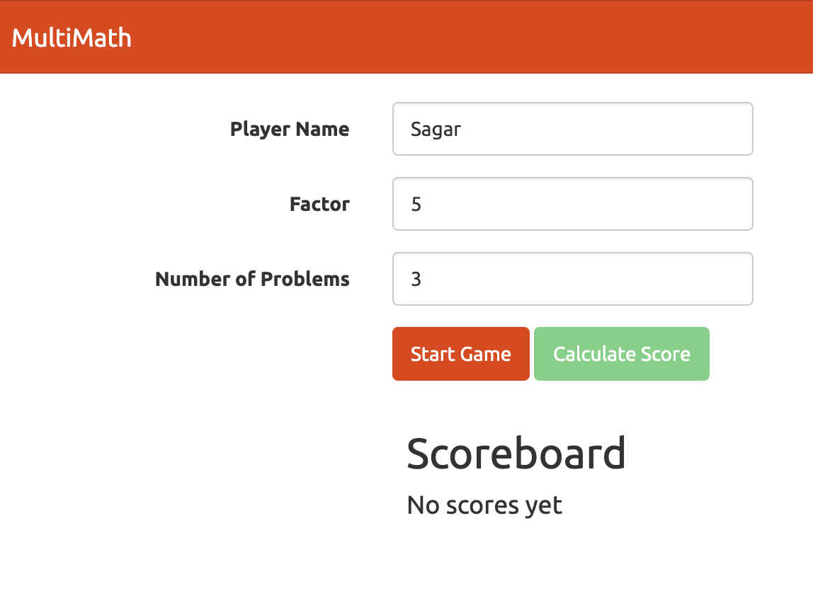

Course: [https://app.pluralsight.com/library/courses/getting-started-typescript](https://app.pluralsight.com/library/courses/getting-started-typescript)

Do `npm install`

Run `npm start`

Open `localhost:8080`

NOTE: This uses ES2015 syntax style unlike what's being used (es5) in the course

DEMO:

